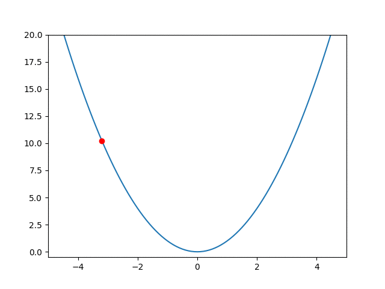
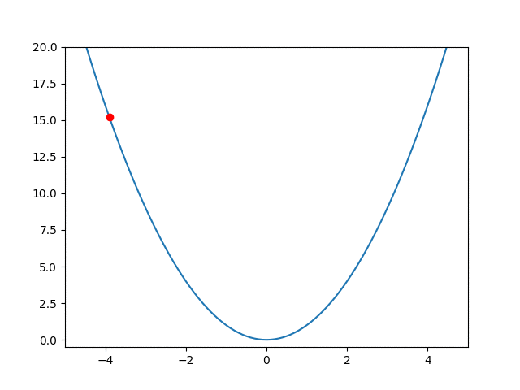

#### How to run

```sh
virtualenv venv -p python3
source venv/bin/activate
pip install -r requirements.txt
./main.py
```

#### GIF

##### SGD



##### ADAM

Below gif may have a problem of not auto-refreshing. If gif stops at the last frame permanently, pls refresh your tab manually


